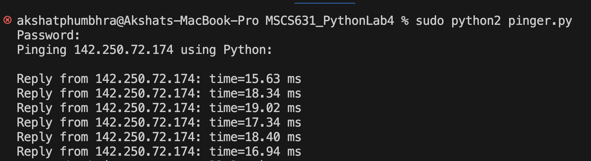
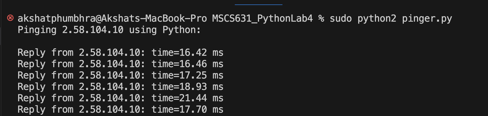

# Lab 4: ICMP

### Oishani Ganguly

## Analysis of RTT Measurements

Three of our targets - Google (North America), Oxford University (Europe), and University of Melbourne (Australia) - all responded in about 15–19 ms, despite being nominally on different continents. That tight clustering shows they’re being served from anycast/CDN edge nodes close to us rather than from their origin datacenters. In contrast, the ping to Tsinghua University averaged ≈ 199 ms, which aligns with the true physical distance and routing delay from our location to China.

## Reflection on the Lab Experience

This lab was a great hands-on introduction to raw‐socket programming in Python and the mechanics of ICMP echo requests. Implementing the checksum by hand and unpacking the IP/ICMP headers reinforced how low-level network protocols operate. Embedding a timestamp in the ICMP payload and calculating one-way delays demonstrated how even a simple tracer tool must carefully manage byte order, packet structure, and timing to produce meaningful measurements.

## Challenges Encountered

The hardest part was finding hosts that actually responded from their true datacenter. Most well-known sites now sit behind global CDNs, so they all returned the same ~17 ms edge latency. Installing and running under Python 2 (to match the skeleton’s ord-based checksum), invoking the script with sudo, and coordinating clean screenshots (ensuring at least four replies per run before hitting Ctrl-C) also required several rounds of trial-and-error. Only Tsinghua University target yielded the high latency I expected for a genuine inter-continental measurement.

## Screenshots

*Ping to 142.250.72.174 (google.com, North America)*

---

  
*Ping to 172.67.20.89 (ox.ac.uk, Europe)*

---

*Ping to 101.6.15.66 (tsinghua.edu.cn, Asia)*

---

  
*Ping to 2.58.104.10 (unimelb.edu.au, Australia)*
